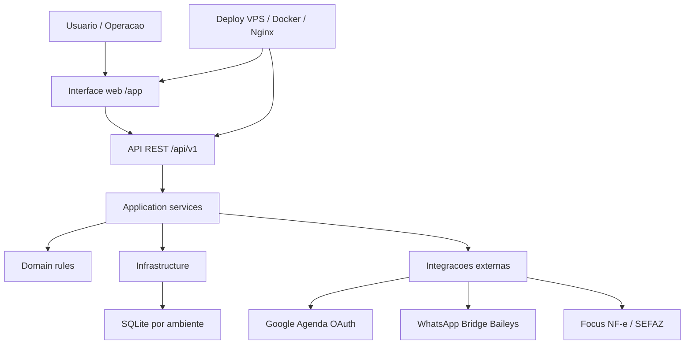

# Organograma Do Estado Atual Do Projeto

Data: 2026-07-10
Projeto: SysPragas 4.1.0
Repositorio alvo: `git@github.com:RodrigoTejada41/PragSys4.0.git`
Branch de publicacao: `main`

## Visao geral

O SysPragas e um monolito modular em camadas, com API FastAPI, interface web propria, banco SQLite por ambiente e modulos opcionais para WhatsApp, Google Agenda, NF-e e SEFAZ.

Ambientes publicados:

| Ambiente | URL | Container | Porta local |
| --- | --- | --- | --- |
| Producao | `https://www.movisystecnologia.com.br/PragSys/app` | `syspragas-prod` | `8011` |
| Dev/teste | `https://www.movisystecnologia.com.br/dev/app` | `syspragas-dev` | `8012` |
| WhatsApp prod | interno | `syspragas-whatsapp-bridge-prod` | `127.0.0.1:3111` |
| WhatsApp dev | interno | `syspragas-whatsapp-bridge-dev` | `127.0.0.1:3112` |

## Organograma tecnico



## Camadas do codigo

| Camada | Caminho | Responsabilidade |
| --- | --- | --- |
| Core | `app/core` | configuracao, seguranca, logging e excecoes |
| Dominio | `app/domain` | enums e regras centrais |
| Aplicacao | `app/application` | servicos, casos de uso, schemas e orquestracao |
| Infraestrutura | `app/infrastructure` | banco, modelos SQLAlchemy e migracoes internas |
| API | `app/interfaces/api` | rotas REST e dependencias HTTP |
| Web | `app/interfaces/web` | interface HTML/CSS/JS propria |
| Modulos | `app/modules` | integracoes especializadas, incluindo SEFAZ |
| Servicos externos | `services/whatsapp-bridge` | bridge WhatsApp por QR Code |
| Automacao | `scripts` e `deploy` | execucao, banco, Docker, Nginx e VPS |

## Modulos funcionais

| Modulo | Estado atual | Pontos principais |
| --- | --- | --- |
| Autenticacao | operacional | login JWT, usuario inicial, protecao da documentacao OpenAPI por usuario MASTER |
| Autorizacao/RBAC | operacional | perfis, permissoes e testes de acesso |
| Clientes | operacional | cadastro, consulta e manutencao via API/UI |
| Ordens de servico | operacional | abertura, acompanhamento, documentos e vinculo com clientes |
| Agendamentos | operacional | agenda tecnica, calendario e integracao opcional com Google Agenda |
| Google Agenda | operacional opcional | OAuth configuravel por ambiente, sem segredo versionado |
| WhatsApp | operacional opcional | QR Code via bridge Baileys, portas internas por ambiente |
| Financeiro | operacional | recibos, financeiro basico e vinculos fiscais |
| Estoque/produtos | operacional | produtos, pragas e apoio a OS |
| NF-e Focus | operacional opcional | provider configuravel, webhook secret e ambiente homologacao/producao |
| NF-e SEFAZ direta | operacional opcional | certificado A1 e XSD por volume seguro |
| Documentos/relatorios | operacional | geracao de documentos, DANFE e exportacoes XLSX |
| Contratos | operacional | vencimento, scheduler e notificacoes internas |
| Multiempresa | base implantada | isolamento por `empresa_prestadora_id` onde aplicavel |
| API Central Orchestrator | MVP documentado | service discovery, health check e gerenciamento inicial |
| Banco/admin | operacional | init, status, seed demo, backup e manutencao documentados |
| Deploy VPS | operacional | Nginx HTTPS, Docker Compose, ambientes prod/dev separados |

## Fluxo de runtime

1. Usuario acessa `/PragSys/app` ou `/dev/app`.
2. Nginx encaminha para o container correto.
3. FastAPI serve a interface web e as rotas `/api/v1`.
4. A aplicacao valida JWT, permissao e licenca.
5. Servicos de aplicacao executam regras de negocio.
6. Infraestrutura persiste dados no SQLite do ambiente.
7. Integracoes externas sao acionadas somente quando habilitadas no `.env`.

## Banco de dados

Modo padrao:

- local: `sqlite:///./syspragas.db`;
- Docker/VPS: `sqlite:////data/syspragas.db`;
- dev Docker pode usar banco separado conforme `.env` do ambiente.

Comandos:

```powershell
python scripts\manage_db.py init
python scripts\manage_db.py status
python scripts\manage_db.py seed-demo
```

## Seguranca atual

Controles existentes:

- `JWT_SECRET` obrigatorio em Docker;
- senha inicial configuravel por ambiente;
- senha armazenada com hash;
- headers de seguranca HTTP;
- CSP com nonce para a aplicacao;
- OpenAPI protegido por HTTP Basic e usuario MASTER;
- segredos fora da documentacao versionada;
- bridge WhatsApp exposta apenas em `127.0.0.1` na VPS.

Pendencias registradas:

- trocar senha root enviada fora do repositorio;
- criar usuario de deploy sem login root direto;
- manter segredos em cofre externo;
- revisar permissoes dos `.env` remotos.

## Qualidade e validacao conhecida

Testes disponiveis:

- `tests/test_auth.py`
- `tests/test_access_control.py`
- `tests/test_rbac.py`
- `tests/test_crud_operations.py`
- `tests/test_work_orders.py`
- `tests/test_appointments.py`
- `tests/test_financial_module.py`
- `tests/test_stock_module.py`
- `tests/test_nfe_direct_module.py`
- `tests/test_nfe_external_integration.py`
- `tests/test_whatsapp_integration.py`
- demais testes em `tests/`.

Validacoes registradas em documentacao operacional:

- `pytest tests/test_whatsapp_integration.py -q` -> `15 passed`;
- containers prod/dev saudaveis em 2026-07-10;
- URLs publicas `/PragSys/app` e `/dev/app` retornando HTTP 200 em 2026-07-10.

## Governanca

Fluxo obrigatorio para novas mudancas:

```text
SPEC -> PLAN -> TASKS -> IMPLEMENTATION -> REVIEW -> QUALITY GATE -> DEPLOY
```

Referencias:

- `AGENTS.md`
- `docs/organograma-corporativo-agentes.md`
- `specs/README.md`
- `docs/ESTADO_ATUAL_PROJETO.md`

## Estado objetivo antes de novas features

- manter `main` como branch publicado e limpo;
- corrigir falhas criticas e altas antes de nova funcionalidade;
- atualizar documentacao junto com mudancas operacionais;
- nao versionar senhas, tokens, certificados ou `.env` reais.
